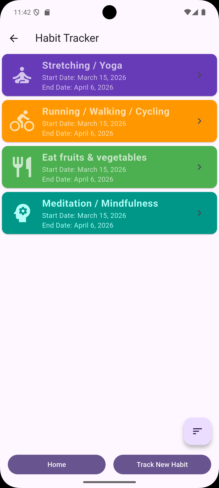
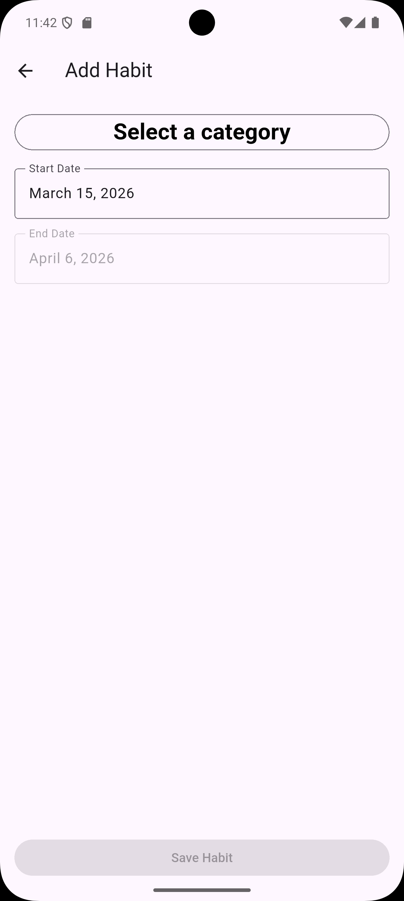
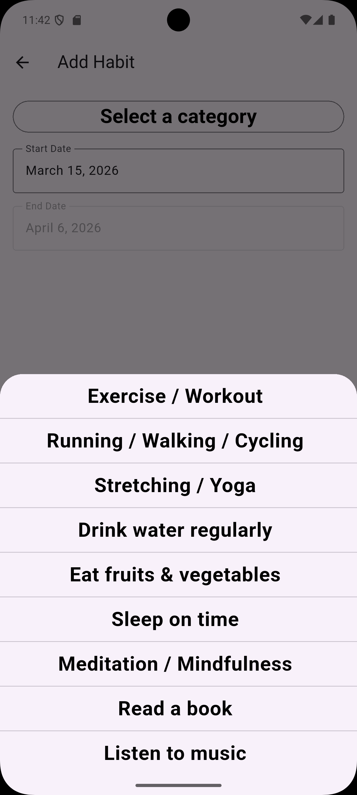
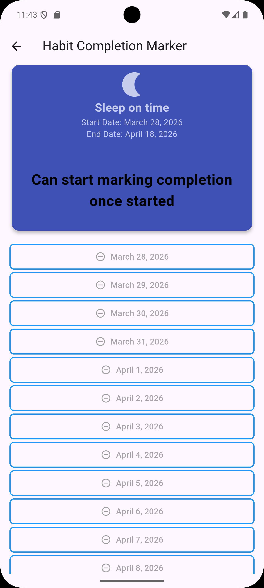
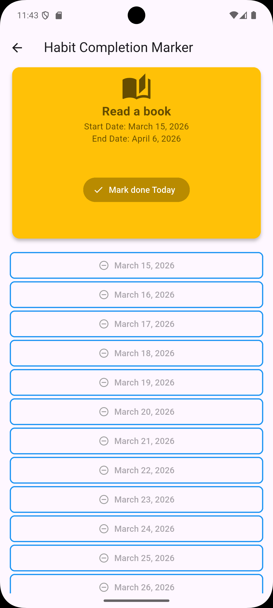
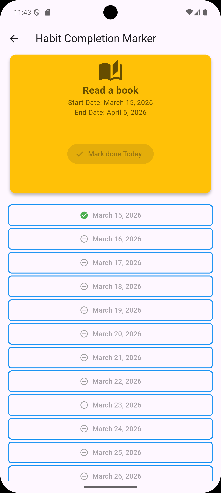
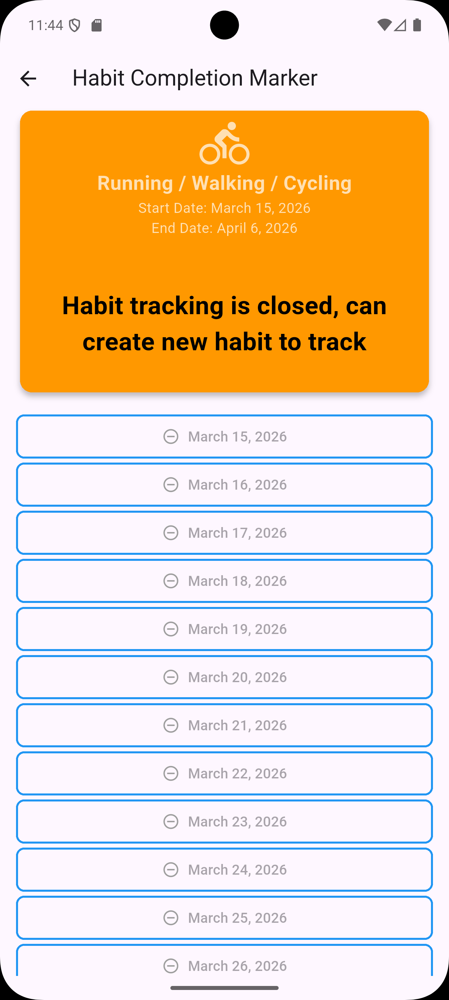

# Habit Formation

A Flutter application designed to help users build and track daily habits. The app provides a structured way to select categories, set start dates, and monitor progress over a 21-day period.

## Screenshots

### Core Screens
|                 Home Screen                 |                Add Habit                |                    Category Selection                     |
|:-------------------------------------------:|:---------------------------------------:|:---------------------------------------------------------:|
|  |  |  |

### Habit Completion Marker (Different States)
|                 Not Started                  | In Progress |                        Already Marked                        |                 Closed                  |
|:--------------------------------------------:| :---: |:------------------------------------------------------------:|:---------------------------------------:|
|  |  |  |  |

## Project Overview

The Habit Formation app allows users to:
- **Create Habits**: Choose from predefined categories and set a start date.
- **Track Progress**: Automatically calculates a 21-day goal and tracks daily completion status.
- **Local Storage**: Persists all habit data locally for offline access.
- **Visual Feedback**: Uses animations (Lottie) and clear UI components to enhance the user experience.

## Architecture

This project follows **Clean Architecture** principles to ensure a separation of concerns, making the codebase maintainable, testable, and scalable.

### Layers:

1.  **Domain Layer**: Contains the core business logic.
    - **Models**: Plain Dart objects representing the business entities (e.g., `HabitModel`).
    - **Repositories (Interfaces)**: Defines the contract for data operations.
    - **Mappers**: Logic to convert between data entities and domain models.

2.  **Data Layer**: Responsible for data retrieval and persistence.
    - **Repositories (Implementations)**: Concrete implementation of the domain repository interfaces.
    - **Entities**: Database schemas for **ObjectBox**.
    - **Stores**: Data sources handling local database operations.

3.  **UI Layer**: Handles the presentation and user interaction.
    - **BLoC (Business Logic Component)**: Manages the state of the application using the `flutter_bloc` package.
    - **Pages/Screens**: Flutter widgets representing different views (Home, Add Habit, etc.).
    - **Components**: Reusable UI widgets.

## Key Technologies & Patterns

- **State Management**: [BLoC](https://pub.dev/packages/flutter_bloc) for predictable state transitions.
- **Dependency Injection**: [GetIt](https://pub.dev/packages/get_it) & [Injectable](https://pub.dev/packages/injectable) for modular and testable code.
- **Database**: [ObjectBox](https://pub.dev/packages/objectbox) for high-performance local NoSQL storage.
- **Routing**: [Auto Route](https://pub.dev/packages/auto_route) for strongly-typed navigation.
- **Code Generation**: [Freezed](https://pub.dev/packages/freezed) for data classes and [Build Runner](https://pub.dev/packages/build_runner).
- **Animations**: [Lottie](https://pub.dev/packages/lottie) for engaging UI animations.

## Getting Started

1.  **Install Dependencies**:
    ```bash
    flutter pub get
    ```
2.  **Run Code Generation**:
    ```bash
    dart run build_runner build --delete-conflicting-outputs
    ```
3.  **Run the App**:
    ```bash
    flutter run
    ```

---
> **Note**: This project has been validated on **Android** only for now due to infrastructure limitations.
